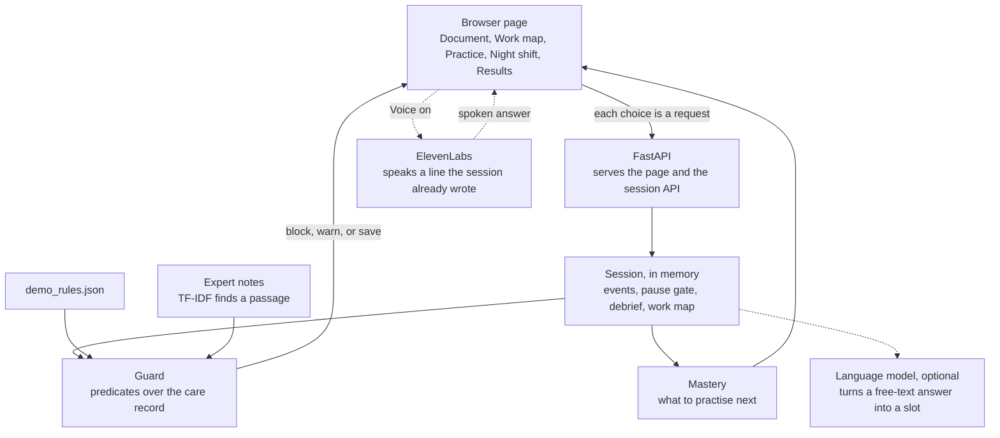

# Night Shift Apprentice

Built for the AI Apprentice challenge (ElevenLabs × Hack-Nation). Experienced people are retiring, and the judgment that made them good at the job was never written down. A recording shows the clicks. It does not show why.

Night shift dementia care is that problem in a high-stakes place. The same wandering can be pain, a full bladder, or someone trying to leave. The wrong note can escalate the risk. Night Shift Apprentice watches a care record being filled in, asks why at a pause, and turns the answer into a work map the expert confirms. A new hire then practises a case the expert never showed. An unsafe record is stopped before it is saved, and the reason is the expert's own words.

It does not diagnose anyone, and it does not decide treatment. A nurse, a physician, or the team still makes those calls.

## What it is

One page, five steps: **Document**, **Work map**, **Practice**, **Night shift**, **Results**.

Document is the capture. The apprentice stays quiet while the record is being filled in, then asks a short question when a guardrail is still open. Work map is the debrief: it asks what the session did not cover, says the process back, and keeps it only after the expert confirms. Practice is the tutor. Night shift is the same check on a live shift. Results shows what was caught and what to practise next.

Voice, when you turn it on, is an ElevenLabs interviewer or tutor. It only speaks a line the app already wrote. A language model, when a key is set, only reads a free-text answer into the map. Neither one can block a save. The rules do that.

## Architecture

One Python process serves the page and makes every decision. The browser never grades itself.



A question waits until the person has paused and a guardrail is still open. The debrief asks what the capture left out, then says the process back. The work map is kept after the expert confirms it. Practice and Night shift send the record through the same guard before anything is saved. Restarting the process clears the session.

## Run it

You need Python 3.12.

```bash
cd hackathon
python3.12 -m venv .venv
source .venv/bin/activate
pip install -r requirements.txt
APPRENTICE_OFFLINE=1 uvicorn engine.api:app --host 127.0.0.1 --port 8000
```

Open [http://127.0.0.1:8000/](http://127.0.0.1:8000/). Work the tabs in order. Restart in the header starts a fresh session.

`APPRENTICE_OFFLINE=1` reads answers with a small local fallback, not a language model. To use the model, put `ANTHROPIC_API_KEY` in `.env` or `.env.local` and start without `APPRENTICE_OFFLINE`. `.env.local` wins if both exist. Voice keys stay in `.env.local`. If you change the agent wording, run `python -m engine.voice.agents` once from this folder.

## What decides save or block

A care record is checked against the rules in `engine/care_map/demo_rules.json`. The check can block it, save it with a warning, or save it. A block shows the trace. Related expert notes are found with TF-IDF. That finds a passage. It does not invent a rule. A person still decides the care.

## Layout

```
hackathon/
  frontend/          the page
  engine/            the API, the session, the guard, the cases
  engine/care_map/   the rules
  data/              expert notes and reviews
```

The page is plain HTML, CSS, and JavaScript. There is no build step. FastAPI serves it and checks each record. Sessions stay in memory. Restarting the process clears them.

## Check the wiring

From this folder, with the virtualenv active and `APPRENTICE_OFFLINE=1` already exported:

```bash
python -c "import engine.tests.test_submission_teach as t; t.test_each_sealed_case_blocks_the_unsafe_record_and_saves_the_safe_one(); t.test_capture_debrief_map_teach_and_night_check_use_the_engine(); t.test_demo_page_is_served_with_the_engine(); print('ok')"
```
