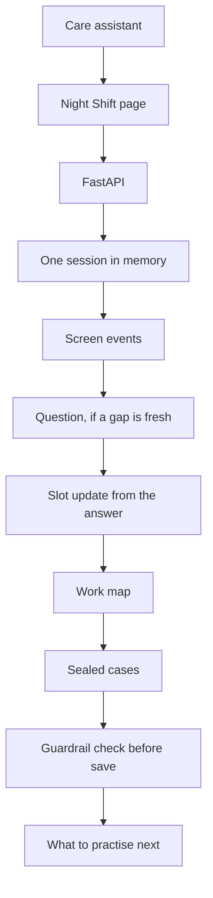
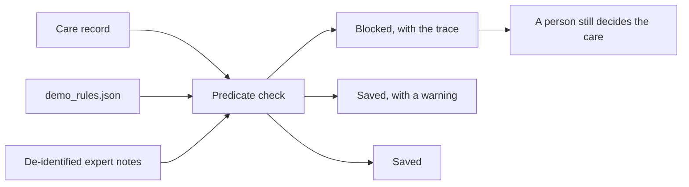

# Night Shift Apprentice

A training tool for night-shift dementia care staff. It watches how a care record for dementia patients is filled in, asks a short question when a guardrail is relevant, and stops an unsafe record before it is saved.

It does not diagnose anyone, and it does not decide treatment. A nurse, a physician, or the team still makes those calls.

## What you run

Two parts, one process.

The **frontend** is a single page: Capture, Map, Teach, Real life, Results. It lives in `frontend/` and is served by the API, so there is no separate web server and no build step.

The **backend** is a Python rules engine. It holds the care rules, the sealed practice cases, and the de-identified expert notes those rules were drawn from. A click in the page is a real request. The page does not grade itself.

## Run it

You need Python 3.12.

```bash
cd hackathon
python3.12 -m venv .venv
source .venv/bin/activate
pip install -r requirements.txt
APPRENTICE_OFFLINE=1 uvicorn engine.api:app --host 127.0.0.1 --port 8000
```

Open [http://127.0.0.1:8000/](http://127.0.0.1:8000/).

Work the tabs in order: Capture, then Map, then Teach, then Real life, then Results. Restart in the header starts a fresh session.

`APPRENTICE_OFFLINE=1` means answers are read with a small local fallback, not a language model. To let the model read free-text answers, put an `ANTHROPIC_API_KEY` in `.env` or `.env.local`, and start uvicorn without `APPRENTICE_OFFLINE`. `.env.local` wins if both files exist.

Voice, when you turn it on, connects the ElevenLabs interviewer or tutor. The engine still writes every line. The agent only speaks it, in one warm voice. A spoken answer is sent after a short pause. The keys stay in `.env.local`. If you change the agent wording, run `python -m engine.voice.agents` once from this folder.

## How a session moves



Capture posts each documentation choice as an event. The engine may ask one question. Map is the debrief of whatever was still open, then the work map built from that session. Teach freezes that map and scores four practice cases. Real life scores four night moments with the same guard, without using up a practice case. Results reads mastery and the decisions from this session.

Voice and the language model sit beside this path. ElevenLabs only speaks a line the engine already wrote. The model, when a key is set, only turns an answer into a slot. Neither one can block a save. The page says the same thing the product is: documentation training, not a diagnosis and not a treatment decision.

Sessions stay in memory. Restarting the process clears them.

## What decides save or block



The live decisions are predicates in `engine/care_map/demo_rules.json`, evaluated by `engine/guard.py`. Retrieval over the expert notes uses TF-IDF. It finds a supporting passage. It does not invent a new rule. A learned card, if a reviewer has accepted one, can warn. It cannot block a save.

## Layout

```
hackathon/
  frontend/          the page, the live controller, the record choices
  engine/            the API, the session, the guard, the cases
  engine/care_map/   the executable rules
  data/              expert notes, learned cards, human reviews
  requirements.txt
  .env.example
```

| Piece | Role |
| --- | --- |
| HTML, CSS, JavaScript | The page. No framework, no build. |
| FastAPI, Pydantic, Uvicorn | HTTP API and the form the guard checks. |
| scikit-learn TF-IDF | Finds related expert notes for a rule. |
| Anthropic, optional | Reads a free-text answer into a slot. Off when `APPRENTICE_OFFLINE=1`. |

## Check the wiring

From the repo root, with the virtualenv active and `APPRENTICE_OFFLINE=1` already exported:

```bash
python -c "import engine.tests.test_submission_teach as t; t.test_each_sealed_case_blocks_the_unsafe_record_and_saves_the_safe_one(); t.test_capture_debrief_map_teach_and_night_check_use_the_engine(); t.test_demo_page_is_served_with_the_engine(); print('ok')"
```
